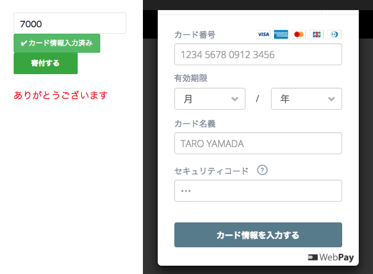
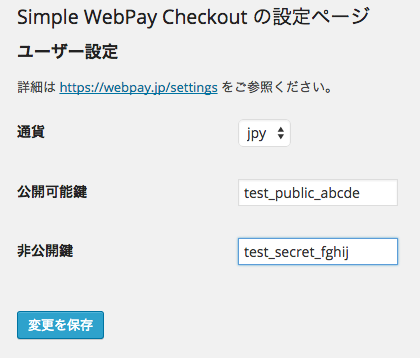

# Simple WebPay Checkout

WordPress の記事に WebPay 決済のためのショートコードを追加します。

## スクリーンショット



## 使い方

記事にショートコードを記載します。

```html
[webpay label="寄付する"]
```

金額は `amount` 属性で指定します。

```html
[webpay amount= 5000 label="寄付する"]
```

## インストールと設定

プロジェクトからファイルをダウンロードして、展開して出てきたフォルダーを `wp-content/plugins/` のもとに設置します。プラグインを有効にした後、管理画面で公開可能鍵と非公開鍵を登録します。

